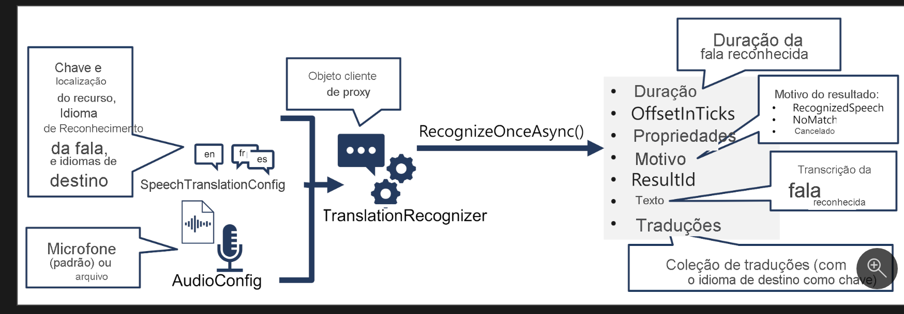

Converter fala em texto

O padrão para tradução de fala usando o SDK de Fala de IA do Azure é semelhante ao reconhecimento de fala, com a adição de informações sobre os idiomas de origem e de destino para tradução:

A TranslationRecognizer object is created from a SpeechConfig, TranslationConfig, and AudioConfig; and its RecognizeOnceAsync method is used to call the Speech API.

Use um objeto SpeechTranslationConfig para encapsular as informações necessárias para se conectar ao seu recurso de Fala de IA do Azure. Especificamente, sua localização e chave.

Converter Fala em Texto

O padrão para tradução de fala usando o SDK de Fala de IA do Azure é semelhante ao reconhecimento de fala, com a adição de informações sobre os idiomas de origem e de destino para tradução.

Um objeto `TranslationRecognizer` é criado a partir de um `SpeechConfig`, `TranslationConfig` e `AudioConfig`, e seu método `RecognizeOnceAsync` é usado para chamar a API de Fala.

Use um objeto `SpeechTranslationConfig` para encapsular as informações necessárias para se conectar ao seu recurso de Fala de IA do Azure, especificamente sua localização e chave.

O objeto `SpeechTranslationConfig` também é usado para especificar o idioma do reconhecimento de fala (o idioma utilizado na fala de entrada) e os idiomas de destino nos quais ele deve ser traduzido.

Como alternativa, use um `AudioConfig` para definir a fonte de entrada para o áudio a ser transcrito. Por padrão, a entrada é o microfone padrão do sistema, mas você também pode especificar um arquivo de áudio.

Use `SpeechTranslationConfig` e `AudioConfig` para criar um objeto `TranslationRecognizer`. Esse objeto é um cliente proxy para a API de tradução do serviço de Fala de IA do Azure.

Use os métodos do objeto `TranslationRecognizer` para chamar as funções de API subjacentes. Por exemplo, o método `RecognizeOnceAsync()` usa o serviço de Fala de IA do Azure para traduzir de modo assíncrono um único enunciado falado.

Processar a resposta do serviço de Fala de IA do Azure. No caso do método `RecognizeOnceAsync()`, o resultado é um objeto `SpeechRecognitionResult` que inclui as seguintes propriedades:

- **Duração**
- **OffsetInTicks**
- **Propriedades**
- **Motivo**
- **ResultId**
- **Texto**
- **Traduções**

Se a operação tiver sido bem-sucedida, a propriedade `Reason` terá o valor enumerado `RecognizedSpeech` e a propriedade `Text` conterá a transcrição no idioma original. Você também pode acessar uma propriedade `Translations` que contém um dicionário das traduções (usando o código de idioma ISO de dois caracteres, como "en" para inglês, como uma chave).
Como alternativa, use um AudioConfig para definir a fonte de entrada para o áudio a ser transcrito. Por padrão, a entrada é o microfone padrão do sistema, mas você também pode especificar um arquivo de áudio.

Use SpeechTranslationConfig e AudioConfig para criar um objeto TranslationRecognizer. Esse objeto é um cliente proxy para a API de tradução do serviço de Fala de IA do Azure.

Use os métodos do objeto TranslationRecognizer para chamar as funções de API subjacentes. Por exemplo, o método RecognizeOnceAsync() usa o serviço de Fala de IA do Azure para traduzir de modo assíncrono um único enunciado falado.

Processar a resposta do serviço de Fala de IA do Azure. No caso do método RecognizeOnceAsync(), o resultado é um objeto SpeechRecognitionResult que inclui as seguintes propriedades:

Duração
OffsetInTicks
Propriedades
Motivo
ResultId
Texto
Translations
Se a operação tiver sido bem-sucedida, a propriedade Reason terá o valor enumerado RecognizedSpeech e a propriedade Text conterá a transcrição no idioma original. Você também pode acessar uma propriedade Translations que contém um dicionário das traduções (usando o código de idioma ISO de dois caracteres, como "en" para inglês, como uma chave).

