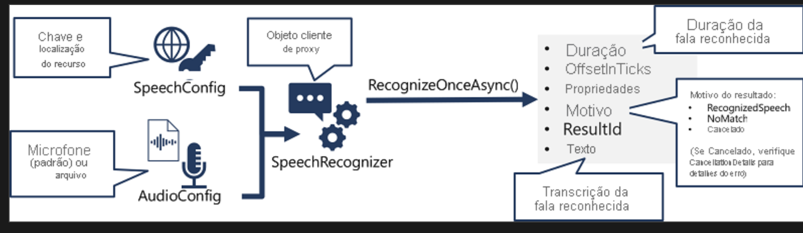
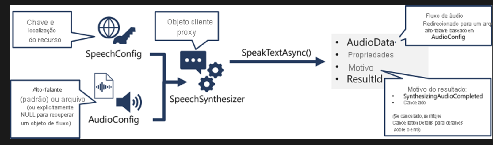

# Usar o SDK de Fala da IA do Azure

Embora os detalhes específicos variem dependendo do SDK que está sendo usado (Python, C# etc.), há um padrão consistente para usar a API de conversão de fala em texto:

Use um objeto `SpeechConfig` para encapsular as informações necessárias para se conectar ao seu recurso de Fala da IA do Azure, especificamente sua localização e chave. Alternativamente, use um `AudioConfig` para definir a fonte de entrada para o áudio a ser transcrito. Por padrão, a entrada é o microfone padrão do sistema, mas você também pode especificar um arquivo de áudio.

Use `SpeechConfig` e `AudioConfig` para criar um objeto `SpeechRecognizer`. Esse objeto é um cliente proxy para a API de conversão de fala em texto. Utilize os métodos do objeto `SpeechRecognizer` para chamar as funções subjacentes da API. Por exemplo, o método `RecognizeOnceAsync()` usa o serviço de Fala da IA do Azure para traduzir de modo assíncrono um único enunciado falado.

Processe a resposta do serviço de Fala da IA do Azure. No caso do método `RecognizeOnceAsync()`, o resultado é um objeto `SpeechRecognitionResult` que inclui as seguintes propriedades:

- `Duration`
- `OffsetInTicks`
- `Properties`
- `Reason`
- `ResultId`
- `Text`

Se a operação tiver sido bem-sucedida, a propriedade `Reason` terá o valor enumerado `RecognizedSpeech` e a propriedade `Text` conterá a transcrição. Outros valores possíveis para `Reason` incluem `NoMatch` (indicando que o áudio foi analisado com êxito, mas nenhuma fala foi reconhecida) ou `Canceled`, indicando que ocorreu um erro (nesse caso, você pode verificar a propriedade `CancellationReason` na coleção `Properties` para determinar o que deu errado).

O padrão para implementar a síntese de fala é semelhante ao do reconhecimento de fala:

Um diagrama mostrando como um objeto `SpeechSynthesizer` é criado a partir de um `SpeechConfig` e `AudioConfig`, e seu método `SpeakTextAsync` é usado para chamar a API de Fala.

Use um objeto `SpeechConfig` para encapsular as informações necessárias para se conectar ao seu recurso de Fala do Azure AI, especificamente sua localização e chave. Opcionalmente, use `AudioConfig` para definir o dispositivo de saída para a fala sintetizada. Por padrão, é o alto-falante padrão do sistema, mas você também pode especificar um arquivo de áudio ou definir explicitamente este valor como nulo para processar diretamente o objeto de fluxo de áudio retornado.

Use `SpeechConfig` e `AudioConfig` para criar um objeto `SpeechSynthesizer`. Este objeto atua como um proxy cliente para a API de texto para fala. Utilize os métodos do objeto `SpeechSynthesizer` para chamar as funções subjacentes da API. Por exemplo, o método `SpeakTextAsync()` usa o serviço de Fala do Azure AI para converter texto em áudio falado.

Processe a resposta do serviço de Fala do Azure AI. No caso do método `SpeakTextAsync`, o resultado é um objeto `SpeechSynthesisResult` que contém as seguintes propriedades:

- `AudioData`
- `Reason`
- `ResultId`
- `ErrorDetails` (se houver)

Se a operação tiver sido bem-sucedida, a propriedade `Reason` terá o valor enumerado `SynthesizingAudioCompleted` e a propriedade `AudioData` conterá o áudio sintetizado. Outros valores possíveis para `Reason` incluem `Canceled`, indicando que ocorreu um erro (nesse caso, você pode verificar a propriedade `ErrorDetails` para determinar o que deu errado).